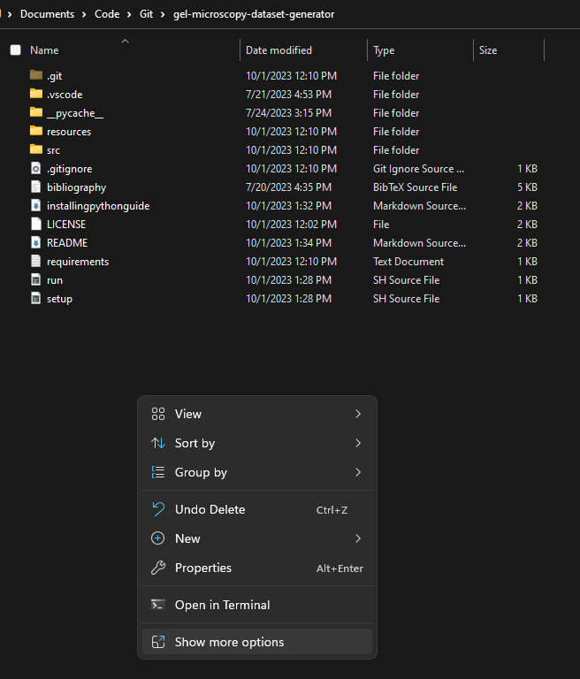

# Introduction

Contains software designed for the generation of gel microscopy datasets. Integrated with Roboflow dataset storage and stores data as COCO-Seg annotations.

# Set-Up and Installation

1. To install the required programs and set up this program, please follow the [set-up instructions](installingpythonguide.md).

2. To run after the set-up instructions have been completed, first navigate in your file explorer to the gel-microscopy-dataset-generator folder (as seen below). Then right click to "Git Bash here" and enter the command "./run.sh". The GUI will then launch.

# Intended Use

Coming soon :)

# Disclaimer

*__This software is under development__.* The contributors claim no responsibility for the use of the software. Please see the [license](https://github.com/ahgaylord/gel-microscopy-dataset-generator/blob/main/LICENSE) for more information.

# Contributions

This software was developed by Amory Gaylord and Cormak Weeks with the contributions and mentorship of Dr. Lilian Hsiao (North Carolina State University).

# Acknowledgements

This research was supported by the North Carolina State University Engineering Enhancement Fee.

# References

Check out the [bibliography](https://github.com/ahgaylord/gel-microscopy-dataset-generator/blob/main/bibliography.bib).

# Cite Us!

If you use this software in your research, please cite us! The bibtex citation for this software is as follows:

    @software{      gel-microscopy-dataset-generator,
      title         = {Gel Microscopy Dataset Generator},
      author        = {Amory Gaylord, Cormak Weeks, Lilian Hsiao},
      year          = {2023},
      keywords      = {Image processing, Open source, Python, Scientific programming},
      url           = {https://github.com/ahgaylord/gel-microscopy-dataset-generator},
      publisher     = {GitHub}
    }
