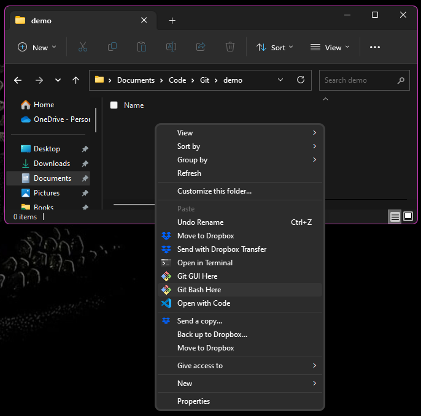
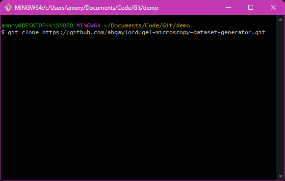

1. First download and install [Git bash](https://git-scm.com/downloads). Then download and install [Python v3.11](https://www.python.org/downloads/).
    
2. Click on the green Code button on the top right hand of this page.

    

3. Select the HTTPS menu and click on the copy icon (two overlaid squares) after the link.

    

4. In your file explorer, navigate to the folder where you want to keep the files for this codebase. Right click and select Show More Options. Then click on Git Bash here.

    

5. In the Git Bash window, type:
 
        git clone 

6. Right click on the git bash window and paste the copied url from step 3. Your git bash window should look as pictured below.

    

7. Click the Enter button on your keyboard.

8. Type in the following commands (** $ denotes the beginning of a new command. Do not enter it onto the command line).

        $ cd gel-microscopy-dataset-generator/src
        $ 