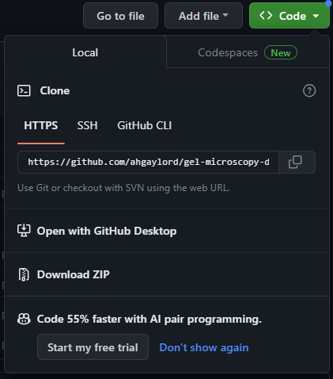
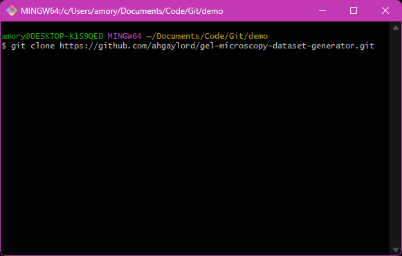

1. First download and install [Git bash](https://git-scm.com/downloads). Then download and install [Python v3.11](https://www.python.org/downloads/). When installing Python, be sure to select the "Add Python to Path" option.
    
2. Copy the following link: https://github.com/ahgaylord/gel-microscopy-dataset-generator.git

3. In your file explorer, navigate to the folder where you want to keep the files for this codebase. Right click and select Show More Options. Then click on Git Bash here.

    

4. In the Git Bash window, type:
 
        git clone 

5. Right click on the git bash window and paste the copied url from step 3. Your git bash window should look as pictured below.

    

6. Click the Enter button on your keyboard.

7. Type in the following commands (** $ denotes the beginning of a new command. Do not enter it onto the command line).

        $ cd gel-microscopy-dataset-generator/src
        $ ./setup.sh

8. Now, to run the GUI now and in future sessions, navigate to the folder containing the files associated with this project (e.g., the gel-microscopy-dataset-generator folder), Git Bash in that folder (see Step 4), and in Git Bash, type:

        ./run.sh